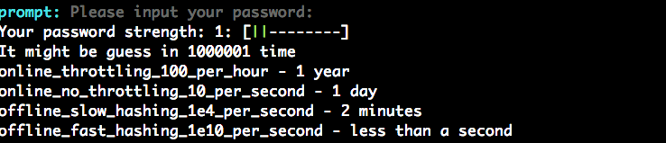

# password-strength-checker
A simple tool to get your input password and analyze its strength, it wrote for my personal sharing and most based on [zxcvbn](https://www.npmjs.com/package/zxcvbn) developed by Dropbox. You can get more detail on their [page](https://github.com/dropbox/zxcvbn) and [blog](https://blogs.dropbox.com/tech/2012/04/zxcvbn-realistic-password-strength-estimation/).

